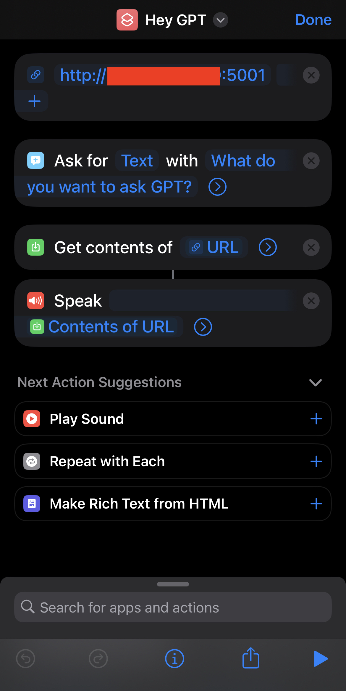

# Siri-GPT

This hacky project aims to improve the functionality of Siri by utilizing ChatGPT. The project is inspired by the frustration of encountering Siri's default response of "I've found this on the web" when asked to perform tasks that are not straightforward.

## Running the API

To run the project, you will need to have Docker and Docker Compose installed on your machine. Once you have these dependencies installed, follow the steps below:

1.  Clone this repository to your local machine.
2.  Navigate to the root directory.
3.  Copy the `.env.example` file to a new file called `.env` using `cp .env.example .env`.
4.  Open the `.env` file in your text editor and set the `OPEN_AI_SESSION_KEY` variable by following the instructions provided in the file.
    1.  You can find the session token by visiting [https://chat.openai.com/api/auth/session](https://chat.openai.com/api/auth/session).
    2.  Press F12 to open console.
    3.  Go to Application > Cookies.
    4.  Copy the session token value in `__Secure-next-auth.session-token`.
5.  Run `docker compose up` to start the project. This will build the necessary Docker images and start the container.
6.  Once the container is running, the API will be exposed on 0.0.0.0:5001.

## Configuring Siri/Shortcuts to Use the API

To configure Siri to use the API:

1.  Open the Shortcuts app on your iPhone.
2.  Create a new shortcut.
3.  Add a "URL" action.
4.  Set the URL to `http://<YOUR_IP_ADDRESS>:5001/`.
5.  Add an "Ask for Input" action.
6.  Set the question to "What do you want to ask GPT?"
7.  Set the variable to "text".
8.  Add a "Get Contents of URL" action.
9.  Set the URL to the variable URL you defined earlier.
10.  Set the method to "POST".
11.  Set the request body to JSON.
12.  Add a field to the body called "message" and set it to "Provided Input".
13.  Add a "Speak" action.
14.  Set the text to "Contents of URL".
15.  Rename the shortcut to something like "Ask GPT" or "Hey GPT".
16.  Save the shortcut.

You can now trigger the shortcut using the prompt "Hey Siri Hey GPT" or whatever you named the shortcut.

## Disclaimers

Please note that this is not an official product of OpenAI and is not affiliated with the company in any way. It is a personal project and any use of it is at the user's own risk. The developer of this project is not responsible for any liabilities or legal issues that may arise from its use.

## Credits

[acheong08](https://github.com/acheong08) - [ChatGPT API](https://github.com/acheong08/ChatGPT)
